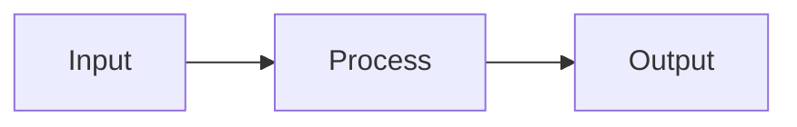

# Book Writer - 書式ルール

サブエージェントとして補足文書を作成する際は、以下の書式ルールを厳守してください。

---

## 1. Box Drawings（罫線文字）

### ❌ 禁止: 全角文字（日本語・中国語など）の使用

```
┌─────────────────────────────────┐
│ ステージ 1: データ収集          │  ← 日本語が入っている（NG）
│ 処理フロー → 結果               │  ← レイアウトが崩れる
└─────────────────────────────────┘
```

### ✅ 正しい: 半角英数字のみ

```
┌─────────────────────────────────┐
│  Stage 1: Data Collection       │  ← 英語のみ（OK）
│  Process Flow -> Result         │  ← 文字幅が揃う
└─────────────────────────────────┘
```

**理由**: 全角文字は文字幅が不揃いになり、罫線がずれてレイアウトが崩れます。Box drawings 内は**必ず半角英数字のみ**を使用してください。

**補足**: Box drawings の**外側**の説明文は日本語でOKです（`ja/` の場合）。

**自動修正**: Box drawings の右端が不揃いな場合は `scripts/fix_box_drawings.py` で自動修正できます。

---

## 2. Quarto 記法

### Callout（補足情報ボックス）

比較情報・発展的内容・補足は Quarto callout で記述します。

**基本構文**:
```markdown
::: {.callout-note}
## タイトル（オプション）
内容
:::
```

**Callout の種類**:
- `.callout-note`: 補足情報（デフォルト、青色）
- `.callout-tip`: ヒント・Tips（緑色）
- `.callout-important`: 重要な情報（赤色）
- `.callout-warning`: 警告（オレンジ色）
- `.callout-caution`: 注意（赤色）

**折りたたみ可能にする**:
```markdown
::: {.callout-note collapse="true"}
## 他モデルとの比較
長い内容はデフォルトで折りたたまれます。
:::
```

**使いどころ**:
- 他モデル・他手法との比較
- 発展的な内容（本筋から逸れるが知っておきたい情報）
- 参考情報・出典
- 詳細な技術的補足

### クロスリファレンス（図表参照）

技術文書では図表やセクションへの参照が頻繁に登場します。

**図の参照**:
```markdown
{#fig-name}

本文中で @fig-name のように参照できます。
```

**表の参照**:
```markdown
| Col1 | Col2 |
|------|------|
| A    | B    |

: Caption {#tbl-name}

本文中で @tbl-name のように参照できます。
```

**セクションの参照**:
```markdown
## セクションタイトル {#sec-name}

本文中で @sec-name のように参照できます。
```

**数式の参照**:
```markdown
$$
y = mx + b
$$ {#eq-linear}

本文中で @eq-linear のように参照できます。
```

詳細は `references/cross-references.md` を参照してください。

### 数式

LaTeX 記法を使用します。

**インライン数式**: `$\frac{4}{\sqrt{n}}$`

**ディスプレイ数式**:
```markdown
$$
\text{weight} = \begin{cases}
0.1 & \text{if video caption} \\
0.2 & \text{if pointing} \\
\frac{4}{\sqrt{n}} & \text{otherwise}
\end{cases}
$$
```

### リスト（箇条書き）

箇条書きリストを始める前には**必ず空行**を入れてください。

#### ❌ 禁止: 空行なし（レンダリング失敗）

```markdown
**データセット規模**:
- **104k のビデオレベルキャプション**
- **431k のクリップレベルキャプション**
- 平均 **924 語/動画** の超詳細記述
```

この書き方では、リストが正しくレンダリングされません。

#### ✅ 正しい: 空行あり

```markdown
**データセット規模**:

- **104k のビデオレベルキャプション**
- **431k のクリップレベルキャプション**
- 平均 **924 語/動画** の超詳細記述
```

または、文章の後にリストを続ける場合:

```markdown
より詳細なキャプションは、モデルに以下の能力を与えます:

- **時空間的な理解**: 「いつ」「どこで」「何が」起きたかを正確に把握
- **細粒度の視覚認識**: 小さな物体、微細な動作、属性の変化を捉える
- **文脈理解**: イベント間の因果関係や時間的依存性を学習
```

**理由**: Markdown/Quarto の仕様では、リストの前に空行がないとリストとして認識されません。

**適用範囲**:
- 順序なしリスト（`-`, `*`, `+`）
- 順序付きリスト（`1.`, `2.`, `3.`）
- チェックリスト（`- [ ]`, `- [x]`）

### リスト項目内の引用（blockquote）

リスト項目内で引用（`>`）を使う場合も、引用の前に空行を入れてください。

#### ❌ 禁止: 引用の前に空行なし

```markdown
1. **高速でスケーラブルなグローバル重複排除**: 兆トークンスケールでの新しいツール
   > 詳細: [Deduplication（重複排除）](05-deduplication.qmd)
```

#### ✅ 正しい: 引用の前に空行あり

```markdown
1. **高速でスケーラブルなグローバル重複排除**: 兆トークンスケールでの新しいツール

   > 詳細: [Deduplication（重複排除）](05-deduplication.qmd)
```

**理由**: リスト項目内の引用も、空行がないと正しくレンダリングされません。

---

## 3. ファイル命名規則

### ディレクトリ構成

```
{lang}/{book}/
├── _metadata.yml           # サイドバーID指定
├── index.qmd               # 本のランディングページ
├── 00-overview.qmd         # メイン文書（全体像）
├── 01-concept-a.qmd        # 補足文書1
├── 02-concept-b.qmd        # 補足文書2
├── 03-concept-c.qmd        # 補足文書3
└── images/                 # 画像ディレクトリ
    └── figure.png
```

### 命名ルール

- **メイン文書**: `00-overview.qmd`（固定）
- **補足文書**: `01-xx.qmd`, `02-xx.qmd`, ...（連番、トピック名をケバブケース）
- **画像**: `images/` ディレクトリに配置
- **拡張子**: `.qmd` を使用（Quarto の機能をフル活用）

---

## 4. リンク

### 相対パス使用

メイン文書から補足文書、または補足文書間のリンクは相対パスを使用します。

**正しい例**:
```markdown
> 詳細: [Sliding Window Attention](01-sliding-window-attention.qmd)

**関連セクション**:
- [Dense Video Captioning](01-dense-video-captioning.qmd)
- [Video Grounding](02-video-grounding.qmd)
```

### ❌ 禁止: 存在しないファイルへのリンク

**NG 例**:
```markdown
- [存在しない文書](99-nonexistent.qmd)  ← このファイルは作成されていない
```

**実在するファイルのみ**にリンクしてください。不明な場合は、メイン文書（`00-overview.qmd`）で定義されている補足文書のリストを確認してください。

### 拡張子

- `.qmd` 拡張子を必ず含める
- `.md` ではなく `.qmd`

---

## 5. 言語の使い分け

### 本文

- `ja/` の場合: 日本語で記述
  - **文体**: である調（断定調）を使用
  - 例: 「〜である」「〜する」「〜となる」
  - ですます調は使用しない
- `en/` の場合: 英語で記述

### 専門用語

初出時に英語を併記します。

**日本語の場合**:
```markdown
強化学習（Reinforcement Learning, RL）を使用して...
```

**英語の場合**:
```markdown
Reinforcement Learning (RL) is used to...
```

### Box Drawings

**必ず英語のみ**（言語によらず共通）

### コード・数式

**英語で記述**（国際的な慣例）

---

## 6. 表・図

### 表の作成

Markdown 形式（Pipe tables）を使用します。

```markdown
| モデル | パラメータ数 | 性能 |
|--------|-------------|------|
| Molmo2-4B | 4B | 85.5 |
| Molmo2-8B | 8B | 86.2 |
```

複雑な表は List tables も使用可能（`references/tables.md` を参照）。

### 図の挿入

```markdown

```

画像は必ず `images/` ディレクトリに配置してください。

---

## 7. Mermaid ダイアグラム

フローチャート・シーケンス図は Mermaid で作成できます。

**例**:
````markdown

````

詳細は `references/diagrams.md` を参照してください。

---

## 8. チェックリスト

補足文書作成時は以下を確認してください：

- [ ] 日本語（`ja/`）の場合は**である調**で記述
- [ ] Box drawings 内は半角英数字のみ使用
- [ ] **リスト前に空行を挿入**（箇条書き、順序付きリスト、チェックリスト全て）
- [ ] **リスト項目内の引用（blockquote）の前にも空行を挿入**
- [ ] Callout は適切に開閉（`:::` の対応）
- [ ] リンクは実在するファイルのみ
- [ ] 拡張子は `.qmd`
- [ ] 画像は `images/` ディレクトリに配置
- [ ] 数式は LaTeX 記法
- [ ] 本文の言語は適切（`ja/` なら日本語、`en/` なら英語）

---

## 9. 参考リソース

より詳細な Quarto 機能については、以下のリファレンスファイルを参照してください：

- `references/callouts.md`: Callout の詳細オプション
- `references/cross-references.md`: 相互参照システム
- `references/figures.md`: 図の挿入・サイズ調整
- `references/tables.md`: 表の作成・スタイリング
- `references/diagrams.md`: Mermaid・Graphviz ダイアグラム

---

**重要**: これらのルールを守ることで、一貫性のある高品質な技術文書を作成できます。不明な点があれば、既存の補足文書（例: `ja/olmo-3/01-sliding-window-attention.md`）を参考にしてください。
